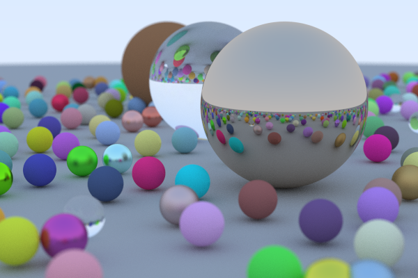

# Raytracing In One Weekend, In Rust!
Rust implemenation of [raytracing in one weekend](https://raytracing.github.io/) by Peter Shirley.

### Shoutouts
- [Fralken's implementation](https://github.com/fralken/ray-tracing-in-one-weekend) helped me quite a bit with their great commit history.
- [Perliedman's implementation](https://github.com/perliedman/raytracing-in-one-weekend) was also a good resource.
- The [Rayon crate](https://github.com/rayon-rs/rayon) is parallelism made easy.

### Tips
- Make your render loop parallel as soon as possible.
- Check out the repos in the shoutouts to see how others accomplished something.
- The cgmath crate is the fastest of the math libraries I tried.

### Lessons Learned
- When following a guide with labeled sections, name or label commits by that chapter.
- Save images of renders as you go.
- At one point I thought the library I was using was the source of an issue with metal being rendered.
